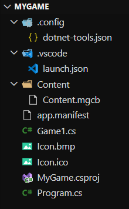

# Developing with Visual Studio Code

Visual Studio Code is a text editor. You can use it on many platforms. With the right setup you can have a good debugging environment for coding your MonoGame projects.

## Setup

Before you start, make sure to [download vscode](https://code.visualstudio.com/download) and install it. Follow [Get started](../get-started/README.md) to get a basic project going.

Open the game's directory in vscode. You can do that by dragging the directory directly over vscode. You should see something like this in the Explorer (Ctrl + Shift + E):



```
.config/
   dotnet-tools.json
.vscode/
   launch.json
Content/
   Content.mgcb
app.manifest
Game1.cs
Icon.bmp
Icon.ico
MyGame.csproj
Program.cs
```

## Extensions

You will need the following extension:

* [C#](https://marketplace.visualstudio.com/items?itemName=ms-dotnettools.csharp)

[C# Dev Kit](https://marketplace.visualstudio.com/items?itemName=ms-dotnettools.csdevkit) is optional, and which one of the two launch configurations below you want depends on whether you run it.

## Launch with C# Dev Kit

The templates ship a `.vscode/launch.json` that uses the `dotnet` debug type, so F5 builds the game, runs it, and stops on your breakpoints with no extra setup:

```json
{
    "version": "0.2.0",
    "configurations": [
      {
        "name": "C#: MyGame Debug",
        "type": "dotnet",
        "request": "launch",
        "projectPath": "${workspaceFolder}/MyGame.csproj"
      }
    ]
}
```

It reads the build and the output path out of the csproj, so there's no `tasks.json` to write and no DLL path to keep in sync.

The C# extension only registers that debug type once C# Dev Kit has activated. If Dev Kit is missing or disabled, F5 gives you `Couldn't find a debug adapter descriptor for debug type 'dotnet'`.

## Launch without C# Dev Kit

The `coreclr` debug type doesn't need Dev Kit, though it does want a build task and the path to the built DLL. Replace the contents of `launch.json` with:

```json
{
   "version": "0.2.0",
   "configurations": [
        {
            "name": "Run DesktopGL platform",
            "type": "coreclr",
            "request": "launch",
            "preLaunchTask": "buildDesktopGL",
            "program": "${workspaceFolder}/bin/Debug/net9.0/MyGame.dll",
            "args": [],
            "cwd": "${workspaceFolder}",
            "console": "internalConsole",
            "stopAtEntry": false
        }
    ]
}
```

Then add a `tasks.json` next to it. Edit the csproj's name if yours is different:

```json
{
    "version": "2.0.0",
    "tasks": [
        {
            "label": "buildDesktopGL",
            "command": "dotnet",
            "type": "process",
            "args": [
                "build",
                "${workspaceFolder}/MyGame.csproj"
            ],
            "problemMatcher": "$msCompile"
        }
    ]
}
```

The `program` path has to match your assembly name and target framework. The one above is for a project called `MyGame` targeting `net9.0`, which is what the templates give you.

## Read more

* [Setting Up VSCode Development Environment For MonoGame](https://github.com/MonoGame/MonoGame/discussions/8131)
* [Tasks in Visual Studio Code.](https://code.visualstudio.com/docs/editor/tasks)
* [Debugging in Visual Studio Code.](https://code.visualstudio.com/docs/editor/debugging)
