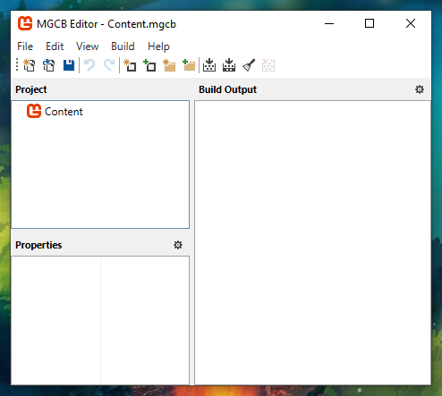

# Get started

This guide will give you the steps to install MonoGame, get a basic project setup, and build an output that you can publish.

## Install

1. Get the [.NET 10.0 SDK](https://dotnet.microsoft.com/download).
   * Test that dotnet is installed correctly:
    ```
    dotnet --version
    ```
2. Get the MonoGame templates:
    ```
    dotnet new install MonoGame.Templates.CSharp
    ```

## Create a new game

Replace `MyGame` with your game's name in the following two command:

```
dotnet new mgdesktopgl -o MyGame
cd MyGame
```

## Run

```
dotnet run
```

## Publish

You can publish on Windows, Mac, and Linux using:

```
dotnet publish -c Release -r win-x64 -o artifacts/windows --self-contained
dotnet publish -c Release -r osx-arm64 -o artifacts/osx-arm64 --self-contained
dotnet publish -c Release -r osx-x64 -o artifacts/osx-x64 --self-contained
dotnet publish -c Release -r linux-x64 -o artifacts/linux --self-contained
```

You'll find the output in:

```
artifacts/windows
artifacts/osx-arm64
artifacts/osx-x64
artifacts/linux
```

Macs have shipped with Apple Silicon since 2020, so `osx-arm64` is the build most of your players need. An `osx-x64` build still runs there through Rosetta, though it's slower and Rosetta isn't installed by default.

Zipping a folder is enough to share the Windows and Linux builds. macOS needs more. The game has to be an `.app` bundle to be double-clickable, and every Mach-O binary inside that bundle has to be signed, since Apple Silicon kills any process whose images aren't. MonoGame covers the bundle layout in [Package games for distribution](https://docs.monogame.net/articles/getting_started/packaging_games.html).

## MonoGame Content Builder Editor

The editor ships as a local dotnet tool, so restore it once per project:

```
dotnet tool restore
```

Then launch it from the root folder of your project:

```
dotnet mgcb-editor Content/Content.mgcb
```

`dotnet build` restores the tools too, so you can skip the restore if you've already built the project once.

You should see this window appear:



## Read more

You can read more getting started info from the official [MonoGame docs](https://docs.monogame.net/articles/getting_started/index.html).

---

Now that you have a project, the next step is to setup a development environment. [Developing with Visual Studio Code](../develop-vscode/README.md).
