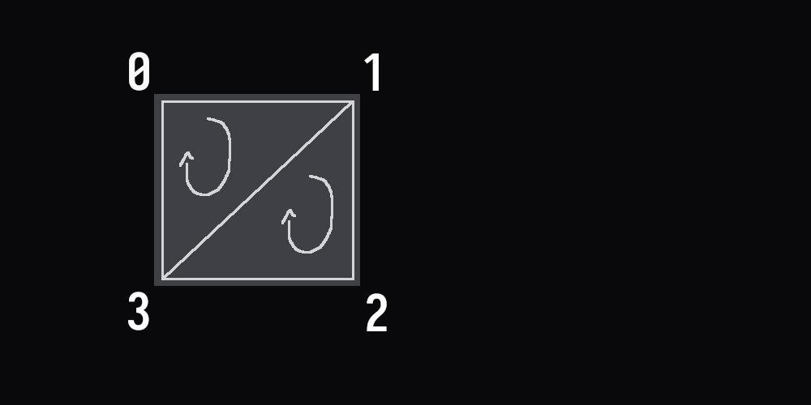

# First Batcher

The default MonoGame SpriteBatch is nice, but when you want to take full control over what gets passed to the GPU it's a good idea to make your own.

This tutorial builds on top of [Get started](../../how-to/get-started.md) and [First shader](../first-shader/README.md).

The first part of this tutorial will walk you through the project setup without explaining much. Once the project is setup and you can run it, you'll be walked through it line by line to understand how everything works under the hood.

## Project setup

The completed project can be found [here](https://github.com/learn-monogame/first-batcher).

### Assets

Add the following image to the `Content` folder and call it `background.png`:


Next to it, create a text file called `first-shader.fx`. Add the following text to it:

```hlsl
#if OPENGL
#define VS_SHADERMODEL vs_3_0
#define PS_SHADERMODEL ps_3_0
#else
#define VS_SHADERMODEL vs_4_0
#define PS_SHADERMODEL ps_4_0
#endif

float4x4 view_projection;
sampler TextureSampler : register(s0);

struct VertexInput {
    float4 Position : POSITION0;
    float4 TexCoord : TEXCOORD0;
    float4 Color : COLOR0;
};
struct PixelInput {
    float4 Position : SV_Position0;
    float4 TexCoord : TEXCOORD0;
    float4 Color : COLOR0;
};

PixelInput SpriteVertexShader(VertexInput v) {
    PixelInput output;

    output.Position = mul(v.Position, view_projection);
    output.TexCoord = v.TexCoord;
    output.Color = v.Color;

    return output;
}
float4 SpritePixelShader(PixelInput p) : SV_TARGET {
    float4 diffuse = tex2D(TextureSampler, p.TexCoord.xy);
    return diffuse * p.Color;
}

technique SpriteBatch {
    pass {
        VertexShader = compile VS_SHADERMODEL SpriteVertexShader();
        PixelShader = compile PS_SHADERMODEL SpritePixelShader();
    }
}

```

### Content pipeline

Open `Content.mgcb` using the MonoGame Content Builder Editor interface. (Read [Get started](../../how-to/get-started.md) to learn how to get it.) Add both to the content pipeline editor as an existing item:


If you open `Content.mgcb` as a text file, this is the content you will see:

```
#----------------------------- Global Properties ----------------------------#

/outputDir:bin/$(Platform)
/intermediateDir:obj/$(Platform)
/platform:DesktopGL
/config:
/profile:Reach
/compress:True

#-------------------------------- References --------------------------------#


#---------------------------------- Content ---------------------------------#

#begin first-shader.fx
/importer:EffectImporter
/processor:EffectProcessor
/processorParam:DebugMode=Auto
/build:first-shader.fx

#begin image.png
/importer:TextureImporter
/processor:TextureProcessor
/processorParam:ColorKeyColor=255,0,255,255
/processorParam:ColorKeyEnabled=True
/processorParam:GenerateMipmaps=False
/processorParam:PremultiplyAlpha=True
/processorParam:ResizeToPowerOfTwo=False
/processorParam:MakeSquare=False
/processorParam:TextureFormat=Color
/build:image.png
```

### Source code

#### FirstVertex.cs

Create a `FirstVertex.cs` file. Paste this content in:

```csharp
using System.Runtime.InteropServices;
using Microsoft.Xna.Framework;
using Microsoft.Xna.Framework.Graphics;

namespace GameProject;

[StructLayout(LayoutKind.Sequential, Pack = 1)]
public struct FirstVertex(Vector3 position, Vector2 textureCoordinate, Color color) : IVertexType {
    public Vector3 Position = position;
    public Vector2 TextureCoordinate = textureCoordinate;
    public Color Color = color;
    public static readonly VertexDeclaration VertexDeclaration;

    VertexDeclaration IVertexType.VertexDeclaration => VertexDeclaration;

    public override readonly int GetHashCode() {
        return System.HashCode.Combine(Position, TextureCoordinate, Color);
    }

    public override readonly string ToString() {
        return
            "{{Position:" + Position +
            " TextureCoordinate:" + TextureCoordinate +
            " Color:" + Color +
            "}}";
    }

    public static bool operator ==(FirstVertex left, FirstVertex right) {
        return
            left.Position == right.Position &&
            left.TextureCoordinate == right.TextureCoordinate &&
            left.Color == right.Color;
    }

    public static bool operator !=(FirstVertex left, FirstVertex right) {
        return !(left == right);
    }

    public override readonly bool Equals(object? obj) {
        if (obj == null)
            return false;

        if (obj.GetType() != base.GetType())
            return false;

        return this == ((FirstVertex)obj);
    }

    static FirstVertex() {
        int offset = 0;
        var elements = new VertexElement[] {
            GetVertexElement(ref offset, VertexElementFormat.Vector3, VertexElementUsage.Position, 0),
            GetVertexElement(ref offset, VertexElementFormat.Vector2, VertexElementUsage.TextureCoordinate, 0),
            GetVertexElement(ref offset, VertexElementFormat.Color, VertexElementUsage.Color, 0),
        };
        VertexDeclaration = new VertexDeclaration(elements);
    }
    private static VertexElement GetVertexElement(ref int offset, VertexElementFormat f, VertexElementUsage u, int usageIndex) {
        return new(OffsetInline(ref offset, Offsets[f]), f, u, usageIndex);
    }
    private static int OffsetInline(ref int value, int offset) {
        int old = value;
        value += offset;
        return old;
    }
    private static readonly Dictionary<VertexElementFormat, int> Offsets = new() {
        [VertexElementFormat.Single] = sizeof(float),
        [VertexElementFormat.Vector2] = sizeof(float) * 2,
        [VertexElementFormat.Vector3] = sizeof(float) * 3,
        [VertexElementFormat.Vector4] = sizeof(float) * 4,
        [VertexElementFormat.Color] = sizeof(int),
        [VertexElementFormat.Byte4] = sizeof(byte) * 4,
        [VertexElementFormat.Short2] = sizeof(short) * 2,
        [VertexElementFormat.Short4] = sizeof(short) * 4,
        [VertexElementFormat.NormalizedShort2] = sizeof(short) * 2,
        [VertexElementFormat.NormalizedShort4] = sizeof(short) * 4,
        [VertexElementFormat.HalfVector2] = sizeof(short) * 2,
        [VertexElementFormat.HalfVector4] = sizeof(short) * 4,
    };
}

```

#### Game1.cs

```csharp
using System;
using Microsoft.Xna.Framework;
using Microsoft.Xna.Framework.Graphics;
using Microsoft.Xna.Framework.Input;

namespace GameProject;

public class Game1 : Game {
    public Game1() {
        _graphics = new GraphicsDeviceManager(this) {
            GraphicsProfile = GraphicsProfile.HiDef
        };
        Content.RootDirectory = "Content";
        IsMouseVisible = true;
    }

    protected override void Initialize() {
        // TODO: Add your initialization logic here

        base.Initialize();
    }

    protected override void LoadContent() {
        _image = Content.Load<Texture2D>("image");
        _firstShader = Content.Load<Effect>("first-shader");

        _vertices = new FirstVertex[_initialVertices];
        _indices = new uint[_initialIndices];

        GenerateIndexArray();

        _vertexBuffer = new DynamicVertexBuffer(GraphicsDevice, typeof(FirstVertex), _vertices.Length, BufferUsage.WriteOnly);

        _indexBuffer = new IndexBuffer(GraphicsDevice, typeof(uint), _indices.Length, BufferUsage.WriteOnly);
        _indexBuffer.SetData(_indices);
    }

    protected override void Update(GameTime gameTime) {
        if (GamePad.GetState(PlayerIndex.One).Buttons.Back == ButtonState.Pressed || Keyboard.GetState().IsKeyDown(Keys.Escape))
            Exit();

        base.Update(gameTime);
    }

    protected override void Draw(GameTime gameTime) {
        GraphicsDevice.Clear(Color.CornflowerBlue);

        Begin();
        Draw(new Vector2(100f, 100f));
        Draw(new Vector2(200f, 300f));
        End();

        base.Draw(gameTime);
    }

    public void Begin(Texture2D? texture = null, Matrix? view = null, Matrix? projection = null, SamplerState? sampler = null) {
        Viewport viewport = GraphicsDevice.Viewport;

        _texture = texture ?? _image;
        _view = view ?? Matrix.Identity;
        _projection = projection ?? Matrix.CreateOrthographicOffCenter(viewport.X, viewport.Width, viewport.Height, viewport.Y, 0, 1);
        _sampler = sampler ?? SamplerState.LinearClamp;
    }

    public void Draw(Vector2 xy, Color? color = null) {
        EnsureSizeOrDouble(ref _vertices, _vertexCount + 4);
        _indicesChanged = EnsureSizeOrDouble(ref _indices, _indexCount + 6) || _indicesChanged;

        Vector2 topLeft = xy + new Vector2(0f, 0f);
        Vector2 topRight = xy + new Vector2(_texture.Width, 0f);
        Vector2 bottomRight = xy + new Vector2(_texture.Width, _texture.Height);
        Vector2 bottomLeft = xy + new Vector2(0f, _texture.Height);

        color ??= Color.White;

        _vertices[_vertexCount + 0] = new FirstVertex(
            new Vector3(topLeft, 0f),
            new Vector2(0f, 0f),
            color.Value
        );
        _vertices[_vertexCount + 1] = new FirstVertex(
            new Vector3(topRight, 0f),
            new Vector2(1f, 0f),
            color.Value
        );
        _vertices[_vertexCount + 2] = new FirstVertex(
            new Vector3(bottomRight, 0f),
            new Vector2(1f, 1f),
            color.Value
        );
        _vertices[_vertexCount + 3] = new FirstVertex(
            new Vector3(bottomLeft, 0f),
            new Vector2(0f, 1f),
            color.Value
        );

        _triangleCount += 2;
        _vertexCount += 4;
        _indexCount += 6;
    }

    public void End() {
        if (_triangleCount == 0) return;

        if (_indicesChanged) {
            _vertexBuffer.Dispose();
            _indexBuffer.Dispose();

            _vertexBuffer = new DynamicVertexBuffer(GraphicsDevice, typeof(FirstVertex), _vertices.Length, BufferUsage.WriteOnly);

            GenerateIndexArray();

            _indexBuffer = new IndexBuffer(GraphicsDevice, typeof(uint), _indices.Length, BufferUsage.WriteOnly);
            _indexBuffer.SetData(_indices);

            _indicesChanged = false;
        }

        _vertexBuffer.SetData(_vertices);
        GraphicsDevice.SetVertexBuffer(_vertexBuffer);

        GraphicsDevice.Indices = _indexBuffer;

        _firstShader.Parameters["view_projection"].SetValue(_view * _projection);
        GraphicsDevice.RasterizerState = RasterizerState.CullCounterClockwise;
        GraphicsDevice.DepthStencilState = DepthStencilState.None;
        GraphicsDevice.BlendState = BlendState.AlphaBlend;
        GraphicsDevice.SamplerStates[0] = _sampler;
        GraphicsDevice.Textures[0] = _texture;

        _firstShader.CurrentTechnique.Passes[0].Apply();
        GraphicsDevice.DrawIndexedPrimitives(PrimitiveType.TriangleList, 0, 0, _triangleCount);

        _triangleCount = 0;
        _vertexCount = 0;
        _indexCount = 0;

        // TODO: Restore old states like rasterizer, depth stencil, blend state?
    }

    private bool EnsureSizeOrDouble<T>(ref T[] array, int neededCapacity) {
        if (array.Length < neededCapacity) {
            Array.Resize(ref array, array.Length * 2);
            return true;
        }
        return false;
    }

    private void GenerateIndexArray() {
        for (uint i = _fromIndex, j = _fromVertex; i < _indices.Length; i += 6, j += 4) {
            _indices[i + 0] = j + 0;
            _indices[i + 1] = j + 1;
            _indices[i + 2] = j + 3;
            _indices[i + 3] = j + 1;
            _indices[i + 4] = j + 2;
            _indices[i + 5] = j + 3;
        }
        _fromIndex = (uint)_indices.Length;
        _fromVertex = (uint)_vertices.Length;
    }

    private GraphicsDeviceManager _graphics;

    private Texture2D _image = null!;
    private Effect _firstShader = null!;

    private const int _initialSprites = 2048;
    private const int _initialVertices = _initialSprites * 4;
    private const int _initialIndices = _initialSprites * 6;

    private SamplerState _sampler = null!;
    private Texture2D _texture = null!;
    private Matrix _view;
    private Matrix _projection;

    private FirstVertex[] _vertices = null!;
    private uint[] _indices = null!;
    private DynamicVertexBuffer _vertexBuffer = null!;
    private IndexBuffer _indexBuffer = null!;

    private int _triangleCount = 0;
    private int _vertexCount = 0;
    private int _indexCount = 0;

    private bool _indicesChanged = false;
    private uint _fromIndex = 0;
    private uint _fromVertex = 0;
}
```

## Explanation

A standard game has a game loop that does logic executed on the CPU and rendering that is done on the GPU. To render, data has to be passed by messages sent from the CPU to the GPU, usually referred to as a draw call. Each draw call will take some time to execute. Typically games have a time budget for each frame of 16.6 milliseconds (60 FPS). For this reason, an optimization technique is to batch or combine as many draw calls as possible to minimize the amount of total draw calls.

This batcher is designed to render quads. A quad is a shape built from four vertices. We can attach data to a vertex which can then be used inside of a shader.

The MonoGame SpriteBatch defines a vertex as a position, color, and texture coordinate (using the `VertexPositionColorTexture` type). We'll build our own vertex type called `FirstVertex` to have more freedom over what can be passed to the shader.

This batcher will allow 2048 different quads in a single batch to start and grow as needed. A single quad is built from 4 vertices.

```csharp
private const int _initialQuads = 2048;
private const int _initialVertices = _initialQuads * 4;
private const int _initialIndices = _initialQuads * 6;
```

```csharp
_vertices = new FirstVertex[_initialVertices];
_indices = new uint[_initialIndices];
```

GPUs are designed to draw triangles natively. We could represent the quad using two triangles built from 6 vertices, duplicating corner 1 and 3, but instead it's possible to send an index array to reuse the same vertice for two different triangles. This helps save data.



The winding (clockwise) order is important since the GPU uses it to determine the front and the back of the triangles. You'll notice later that we set the culling to `RasterizerState.CullCounterClockwise`. Triangles that are seen from behind would not get rendered. The first triangle here is 0, 1, 3 and the second is 1, 2, 3.

```csharp
private void GenerateIndexArray() {
    for (uint i = _fromIndex, j = _fromVertex; i < _indices.Length; i += 6, j += 4) {
        _indices[i + 0] = j + 0;
        _indices[i + 1] = j + 1;
        _indices[i + 2] = j + 3;
        _indices[i + 3] = j + 1;
        _indices[i + 4] = j + 2;
        _indices[i + 5] = j + 3;
    }
    _fromIndex = (uint)_indices.Length;
    _fromVertex = (uint)_vertices.Length;
}
```

This `GenerateIndexArray` function is coded this way to allow for resizing the index array later and start from the last index position.

`_vertices` and `_indices` are currently on the CPU. To pass them to the GPU, we use a VertexBuffer and IndexBuffer respectively so that they become a `GraphicsResource`. `DynamicVertexBuffer` means that we expect the content of the `_vertices` to change every frame.

```csharp
_vertexBuffer = new DynamicVertexBuffer(GraphicsDevice, typeof(FirstVertex), _vertices.Length, BufferUsage.WriteOnly);

_indexBuffer = new IndexBuffer(GraphicsDevice, typeof(uint), _indices.Length, BufferUsage.WriteOnly);
_indexBuffer.SetData(_indices);
```

Since `_indices` only needs to be reuploaded when the batch resizes, we can send it right away using `SetData`. For `_vertices`, we'll wait until we're ready to send the batch before using `SetData`.

---

The API design for this batcher is similar to the MonoGame SpriteBatch. I kept it simple so that you can adapt it to your needs. It provides 3 methods:

```csharp
public void Begin(Texture2D? texture = null, Matrix? view = null, Matrix? projection = null, SamplerState? sampler = null);
```
```csharp
public void Draw(Vector2 xy, Color? color = null);
```
```csharp
public void End();
```

Notice that the texture to draw is passed as an argument in `Begin`. This is because changing the texture invalidates the batch and I wanted to keep `Draw` simpler for the purposes of this tutorial. I leave passing the texture in `Draw` as an exercise to the reader.

```csharp
public void Draw(Vector2 xy, Color? color = null) {
    EnsureSizeOrDouble(ref _vertices, _vertexCount + 4);
    _indicesChanged = EnsureSizeOrDouble(ref _indices, _indexCount + 6) || _indicesChanged;

    Vector2 topLeft = xy + new Vector2(0f, 0f);
    Vector2 topRight = xy + new Vector2(_texture.Width, 0f);
    Vector2 bottomRight = xy + new Vector2(_texture.Width, _texture.Height);
    Vector2 bottomLeft = xy + new Vector2(0f, _texture.Height);

    color ??= Color.White;

    _vertices[_vertexCount + 0] = new FirstVertex(
        new Vector3(topLeft, 0f),
        new Vector2(0f, 0f),
        color.Value
    );
    _vertices[_vertexCount + 1] = new FirstVertex(
        new Vector3(topRight, 0f),
        new Vector2(1f, 0f),
        color.Value
    );
    _vertices[_vertexCount + 2] = new FirstVertex(
        new Vector3(bottomRight, 0f),
        new Vector2(1f, 1f),
        color.Value
    );
    _vertices[_vertexCount + 3] = new FirstVertex(
        new Vector3(bottomLeft, 0f),
        new Vector2(0f, 1f),
        color.Value
    );

    _triangleCount += 2;
    _vertexCount += 4;
    _indexCount += 6;
}
```

The first part of Draw makes sure that we have enough room in the arrays to hold the quad. If there isn't, the strategy is to double the size of the arrays.

After that the position of the quad is determined in world coordinates for all the vertices. In this case we just use the texture's size directly offset by the `xy` parameter. You could add scaling or rotation math here. This batcher is designed for 2D rendering so the Z axis is hardcoded to 0 in the `Vector3` since we don't care about it.

The second parameter in the `FirstVertex` is the texture coordinate. It's a floating point value between 0 and 1. On the X axis, 0 means the left side of the texture and 1 means the right side. On the Y axis, 0 means the top side of the texture and 1 means the bottoms side. Here we hardcoded the values to use the full texture range but if you wanted to support sprite sheets, you could pass different values.

The third parameter is just a tint color that's added for fun.

In the shader those values come in as:

```hlsl
struct VertexInput {
    float4 Position : POSITION0;
    float4 TexCoord : TEXCOORD0;
    float4 Color : COLOR0;
};
```

Since the quad requires two triangles, we add two to the triangle count. It requires four vertices so we add 4 to the vertex count. It requires 6 indices so we add six to the index count.

```csharp
_triangleCount += 2;
_vertexCount += 4;
_indexCount += 6;
```

Finally there's the `End` method:

```csharp
private void End() {
    if (_triangleCount == 0) return;

    if (_indicesChanged) {
        _vertexBuffer.Dispose();
        _indexBuffer.Dispose();

        _vertexBuffer = new DynamicVertexBuffer(GraphicsDevice, typeof(FirstVertex), _vertices.Length, BufferUsage.WriteOnly);

        GenerateIndexArray();

        _indexBuffer = new IndexBuffer(GraphicsDevice, typeof(uint), _indices.Length, BufferUsage.WriteOnly);
        _indexBuffer.SetData(_indices);

        _indicesChanged = false;
    }

    _vertexBuffer.SetData(_vertices);
    GraphicsDevice.SetVertexBuffer(_vertexBuffer);

    GraphicsDevice.Indices = _indexBuffer;

    _firstShader.Parameters["view_projection"].SetValue(_view * _projection);
    GraphicsDevice.RasterizerState = RasterizerState.CullCounterClockwise;
    GraphicsDevice.DepthStencilState = DepthStencilState.None;
    GraphicsDevice.BlendState = BlendState.AlphaBlend;
    GraphicsDevice.SamplerStates[0] = _sampler;
    GraphicsDevice.Textures[0] = _texture;

    _firstShader.CurrentTechnique.Passes[0].Apply();
    GraphicsDevice.DrawIndexedPrimitives(PrimitiveType.TriangleList, 0, 0, _triangleCount);

    _triangleCount = 0;
    _vertexCount = 0;
    _indexCount = 0;
}
```

This method sends the batch to the GPU to be drawn.

Of course, don't do any work if nothing is being drawn (aka no triangles). If the indices have changed, regenerate the index array to add the missing indices and recreate the `GraphicsResource` (`DynamicVertexBuffer` and `IndexBuffer`).

Behind the scene, MonoGame doesn't do any extra work if the indices haven't changed:

```csharp
GraphicsDevice.Indices = _indexBuffer;
```

Here we set the rendering states for the current batch:

```csharp
_firstShader.Parameters["view_projection"].SetValue(_view * _projection);
GraphicsDevice.RasterizerState = RasterizerState.CullCounterClockwise;
GraphicsDevice.DepthStencilState = DepthStencilState.None;
GraphicsDevice.BlendState = BlendState.AlphaBlend;
GraphicsDevice.SamplerStates[0] = _sampler;
GraphicsDevice.Textures[0] = _texture;
```

Batching requires that all elements being drawn share the same global states. The only differences between what is drawn should be set in the vertices (our `FirstVertex` type). This is one of the reason that having your own batcher is beneficial since you can add more data that could be used in your shaders. A lot of the time, MonoGame devs have to work around the SpriteBatch limitations, having less efficient batches when the data they change globally could be set in the vertices that they don't control. (SpriteSortMode.Immediate anyone?)

If any values here change, you have to end the batch.

## Read more

* [Render Hell 2.0](https://simonschreibt.de/gat/renderhell/)
