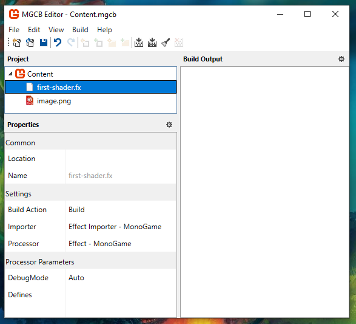
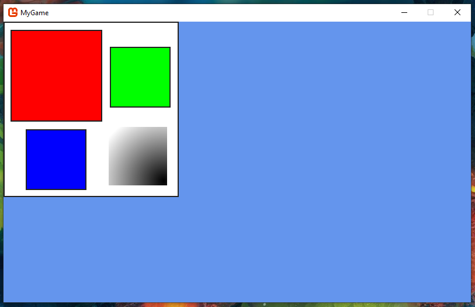

# First shader

In order to understand shaders from the ground up, I like to start from the most basic setup. In this tutorial, you'll learn how to write your own shader to draw a texture to the screen.

This tutorial builds on top of [Get started](../../how-to/get-started.md).

The first part of this tutorial will walk you through the project setup without explaining much. Once the project is setup and you can run it, you'll be walked through it line by line to understand how everything works under the hood.

## Project setup

### Assets

Add the following image to the `Content` folder and call it `image.png`:


Next to it, create a text file called `first-shader.fx`. Add the following text to it:

```hlsl
#if OPENGL
#define VS_SHADERMODEL vs_3_0
#define PS_SHADERMODEL ps_3_0
#else
#define VS_SHADERMODEL vs_4_0
#define PS_SHADERMODEL ps_4_0
#endif

float4x4 view_projection;
sampler TextureSampler : register(s0);

struct VertexInput {
    float4 Position : POSITION0;
    float4 Color : COLOR0;
    float4 TexCoord : TEXCOORD0;
};
struct PixelInput {
    float4 Position : SV_Position0;
    float4 Color : COLOR0;
    float4 TexCoord : TEXCOORD0;
};

PixelInput SpriteVertexShader(VertexInput v) {
    PixelInput output;

    output.Position = mul(v.Position, view_projection);
    output.Color = v.Color;
    output.TexCoord = v.TexCoord;
    return output;
}
float4 SpritePixelShader(PixelInput p) : SV_TARGET {
    float4 diffuse = tex2D(TextureSampler, p.TexCoord.xy);
    return diffuse * p.Color;
}

technique SpriteBatch {
    pass {
        VertexShader = compile VS_SHADERMODEL SpriteVertexShader();
        PixelShader = compile PS_SHADERMODEL SpritePixelShader();
    }
}
```

### Content pipeline

Open `Content.mgcb` using the MonoGame Content Builder Editor interface. (Read [Get started](../../how-to/get-started.md) to learn how to get it.) Add both to the content pipeline editor as an existing item:


The pipeline will look like this:



If you open `Content.mgcb` as a text file, this is the content you will see:

```
#----------------------------- Global Properties ----------------------------#

/outputDir:bin/$(Platform)
/intermediateDir:obj/$(Platform)
/platform:DesktopGL
/config:
/profile:Reach
/compress:False

#-------------------------------- References --------------------------------#


#---------------------------------- Content ---------------------------------#

#begin first-shader.fx
/importer:EffectImporter
/processor:EffectProcessor
/processorParam:DebugMode=Auto
/build:first-shader.fx

#begin image.png
/importer:TextureImporter
/processor:TextureProcessor
/processorParam:ColorKeyColor=255,0,255,255
/processorParam:ColorKeyEnabled=True
/processorParam:GenerateMipmaps=False
/processorParam:PremultiplyAlpha=True
/processorParam:ResizeToPowerOfTwo=False
/processorParam:MakeSquare=False
/processorParam:TextureFormat=Color
/build:image.png
```

### Load the assets in the game

In your `Game1.cs` file, add the fields to hold your assets below the SpriteBatch field:

```csharp
private GraphicsDeviceManager _graphics;
private SpriteBatch _spriteBatch;

private Texture2D _image;
private Effect _firstShader;
```

In the game's constructor, set the `GraphicsProfile` to `HiDef` (this makes it possible to use shader model 4.0 in WindowsDX builds, without it you'll get a cryptic error that says `The parameter is incorrect.`.):

```csharp
public Game1() {
    _graphics = new GraphicsDeviceManager(this);
    _graphics.GraphicsProfile = GraphicsProfile.HiDef;
    Content.RootDirectory = "Content";
    IsMouseVisible = true;
}
```

In the `LoadContent` method, load your assets:

```csharp
protected override void LoadContent() {
    _spriteBatch = new SpriteBatch(GraphicsDevice);

    _image = Content.Load<Texture2D>("image");
    _firstShader = Content.Load<Effect>("first-shader");
}
```

### Use the assets

In the `Draw` method, add the following code:

```csharp
protected override void Draw(GameTime gameTime) {
    GraphicsDevice.Clear(Color.CornflowerBlue);

    Matrix view = Matrix.Identity;

    int width = GraphicsDevice.Viewport.Width;
    int height = GraphicsDevice.Viewport.Height;
    Matrix projection = Matrix.CreateOrthographicOffCenter(0, width, height, 0, 0, 1);

    _firstShader.Parameters["view_projection"].SetValue(view * projection);

    _spriteBatch.Begin(effect: _firstShader);
    _spriteBatch.Draw(_image, new Vector2(0, 0), Color.White);
    _spriteBatch.End();

    base.Draw(gameTime);
}
```

If you run the game with `dotnet run`, you should see this window:



This is all the setup that you need for this tutorial. In the next parts, I will do a breakdown of the code above explaining everything that is going on.

### Source code

#### Game1.cs

```csharp
using Microsoft.Xna.Framework;
using Microsoft.Xna.Framework.Graphics;
using Microsoft.Xna.Framework.Input;

namespace MyGame {
    public class Game1 : Game {
        private GraphicsDeviceManager _graphics;
        private SpriteBatch _spriteBatch;

        private Texture2D _image;
        private Effect _firstShader;

        public Game1() {
            _graphics = new GraphicsDeviceManager(this);
            Content.RootDirectory = "Content";
            IsMouseVisible = true;
        }

        protected override void Initialize() {
            base.Initialize();
        }

        protected override void LoadContent() {
            _spriteBatch = new SpriteBatch(GraphicsDevice);

            _image = Content.Load<Texture2D>("image");
            _firstShader = Content.Load<Effect>("first-shader");
        }

        protected override void Update(GameTime gameTime) {
            if (GamePad.GetState(PlayerIndex.One).Buttons.Back == ButtonState.Pressed || Keyboard.GetState().IsKeyDown(Keys.Escape))
                Exit();

            base.Update(gameTime);
        }

        protected override void Draw(GameTime gameTime) {
            GraphicsDevice.Clear(Color.CornflowerBlue);

            Matrix view = Matrix.Identity;

            int width = GraphicsDevice.Viewport.Width;
            int height = GraphicsDevice.Viewport.Height;
            Matrix projection = Matrix.CreateOrthographicOffCenter(0, width, height, 0, 0, 1);

            _firstShader.Parameters["view_projection"].SetValue(view * projection);

            _spriteBatch.Begin(effect: _firstShader);
            _spriteBatch.Draw(_image, new Vector2(0, 0), Color.White);
            _spriteBatch.End();

            base.Draw(gameTime);
        }
    }
}
```

## How does it work?

```csharp
Matrix view = Matrix.Identity;
```

`view` is a 4x4 matrix. This matrix is used to convert from world coordinates to view (camera) coordinates. Here is an example of those coordinates for a window that has dimensions of 1000px by 500px:


Right now, this one is set to the identity matrix which means that it takes the world coordinates as is. You can have a bit of fun if you give it a value:

```csharp
Matrix view =
    Matrix.CreateScale(2f, 3f, 1f) *
    Matrix.CreateRotationZ(MathHelper.PiOver4) *
    Matrix.CreateTranslation(400, 50, 0);
```

---

```csharp
int width = GraphicsDevice.Viewport.Width;
int height = GraphicsDevice.Viewport.Height;
Matrix projection = Matrix.CreateOrthographicOffCenter(0, width, height, 0, 0, 1);
```

First things first, get the `width` and `height` values from the viewport. Putting them into a local variable helps the code's readability. We then create a projection matrix. This projection matrix is used to convert from view (camera) coordinates into homogeneous coordinates which range from -1 to 1 on the X axis and 1 to -1 on the Y axis. The previous view coordinates end up looking like this:


If you want to test it out for yourself, you can feed it various world coordinates to see what it outputs:

```csharp
Vector2 test = new Vector(10, 20);
Vector2 result = Vector2.Transform(test, view * projection);
Console.WriteLine(result);
```

---

```csharp
_firstShader.Parameters["view_projection"].SetValue(view * projection);
```

Pass the view and the projection matrix together to our shader.

---

```csharp
_spriteBatch.Begin(effect: _firstShader);
_spriteBatch.Draw(_image, new Vector2(0, 0), Color.White);
_spriteBatch.End();
```

Give the shader to the MonoGame SpriteBatch and draw the image texture at the world position `(0, 0)`. Behind the scene, the SpriteBatch will setup the texture sampler in slot 0 for us.

We also pass in a color. For this shader, the color is used as a tint color. White means there is no tint. Colors have their alpha premultiplied which allows you to reduce the texture's opacity by doing `Color.White * 0.5f` (Giving you the rgba color `(127, 127, 127, 127)`).

---

At the top of the shader, you can see the following code:

```hlsl
#if OPENGL
#define VS_SHADERMODEL vs_3_0
#define PS_SHADERMODEL ps_3_0
#else
#define VS_SHADERMODEL vs_4_0
#define PS_SHADERMODEL ps_4_0
#endif
```

This sets up two values, `VS_SHADERMODEL` and `PS_SHADERMODEL` so that the shader can work in both DesktopGL and WindowsDX projects.

---

```hlsl
float4x4 view_projection;
```

`view_projection` is the parameter you passed in earlier. From the type you can see that it's a 4x4 matrix that contains floats.

---

```hlsl
sampler TextureSampler : register(s0);
```

`TextureSampler` is passed in by the MonoGame SpriteBatch. `s` means we get a `Sampler` and the `0` is the index. The MonoGame SpriteBatch set that up for us. It makes it possible to sample from `_image`.

---

```hlsl
struct VertexInput {
    float4 Position : POSITION0;
    float4 Color : COLOR0;
    float4 TexCoord : TEXCOORD0;
};
```

This structure gets passed to the vertex shader. Position is in the world coordinate.

Color is the value passed in the SpriteBatch draw call. Earlier we set it to white. In the shader, the color becomes a floating point value between 0 and 1. For example white is `(1, 1, 1, 1)`. White with a 50% opacity becomes `(0.5, 0.5, 0.5, 0.5)`.

`TexCoord` is in UV coordinates. It's a floating point value between 0 and 1. On the X axis, 0 means the left side of the texture and 1 means the right side. On the Y axis, 0 means the top side of the texture and 1 means the bottoms side.

---

```hlsl
PixelInput SpriteVertexShader(VertexInput v) {
    PixelInput output;

    output.Position = mul(v.Position, view_projection);
    output.Color = v.Color;
    output.TexCoord = v.TexCoord;
    return output;
}
```

The vertex shader here is used to apply the view projection matrix to the position that is in world coordinates. After the matrix multiplication, the position get converted to the homogeneous coordinates that I mentioned earlier.

The color and the texcoord are kept as is.

---

```hlsl
struct PixelInput {
    float4 Position : SV_Position0;
    float4 Color : COLOR0;
    float4 TexCoord : TEXCOORD0;
};
```

This struct is the result from the vertex shader that we generated.

---

```hlsl
float4 SpritePixelShader(PixelInput p) : SV_TARGET {
    float4 diffuse = tex2D(TextureSampler, p.TexCoord.xy);
    return diffuse * p.Color;
}
```

The final step of this shader is to output a color for each pixels on the screen. First we sample the diffuse color for this pixel at the texture UV. Then the diffuse is multiplied by the tint color.

---

The vertex and pixel shaders are executed on the computer's GPU.

---

```hlsl
technique SpriteBatch {
    pass {
        VertexShader = compile VS_SHADERMODEL SpriteVertexShader();
        PixelShader = compile PS_SHADERMODEL SpritePixelShader();
    }
}
```

The technique exposes the Vertex and Pixel shaders. These lines work on the DesktopGL and WindowsDX platforms thanks to the defines from earlier.

It's possible for a technique to have multiple passes.

## Notes

MonoGame's shader compiler optimizes the code that it compiles. If a parameter isn't used, it will be deleted. If you try to pass a value under that parameter name from the C# side you will get the `Object reference not set to an instance of an object.` error. One quick workaround while developing is to use the null conditional operator:

```csharp
_firstShader.Parameters["super_parameter"]?.SetValue(42f);
```

This will allow you to easily edit your shader code without having to constantly change your C# code.

## Follow up

A follow up tutorial can be read here: [Infinite background shader](../infinite-background-shader/README.md)
