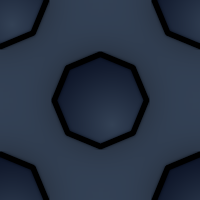
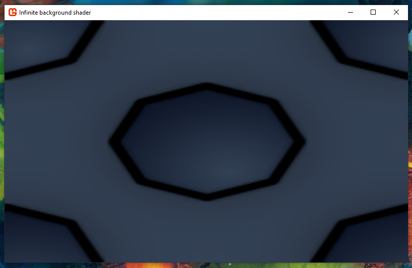
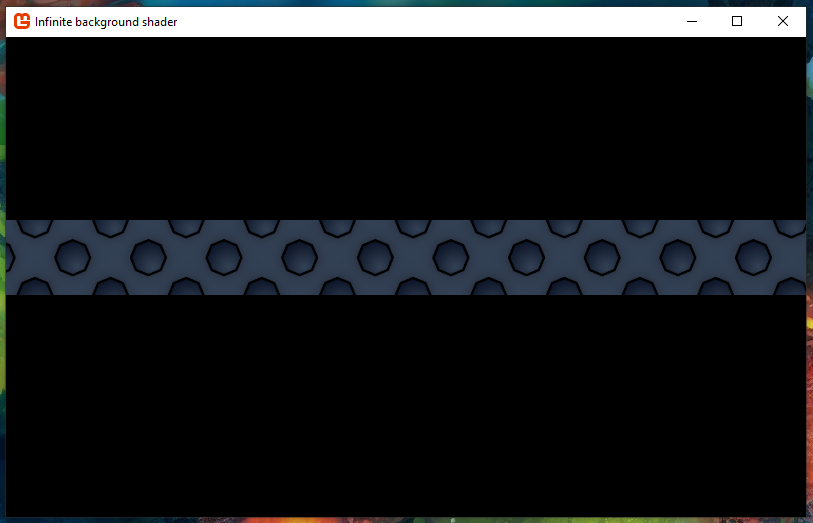
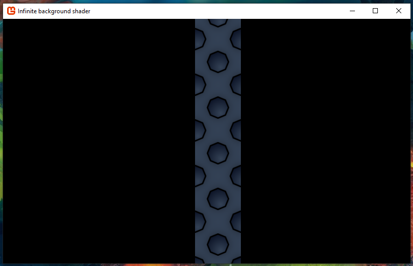

# Infinite background shader
Tile an infinite background in no time! This tutorial will teach you how to write a shader that will tile a background infinitely or along any axis.

This tutorial builds on top of [Get started](../../how-to/get-started.md) and [First shader](../first-shader/README.md).

The first part of this tutorial will walk you through the project setup without explaining much. Once the project is setup and you can run it, you’ll be walked through it line by line to understand how everything works under the hood.

## Project setup

The completed project can be found [here](https://github.com/learn-monogame/infinite-background-shader).

### Libraries

This tutorial relies on the [Apos.Input](https://github.com/Apostolique/Apos.Input) library.

You can install it with the following command:

```
dotnet add package Apos.Input
```

Apos.Input provides a simplified API over the MonoGame mouse and keyboard API.

### Assets

Add the following image to the `Content` folder and call it `background.png`:



Next to it, create a text file called `infinite.fx`. Add the following text to it:

```hlsl
#if OPENGL
#define VS_SHADERMODEL vs_3_0
#define PS_SHADERMODEL ps_3_0
#else
#define VS_SHADERMODEL vs_4_0
#define PS_SHADERMODEL ps_4_0
#endif

float4x4 view_projection;
float4x4 uv_transform;
sampler TextureSampler : register(s0);

struct VertexInput {
    float4 Position : POSITION0;
    float4 Color : COLOR0;
    float4 TexCoord : TEXCOORD0;
};
struct PixelInput {
    float4 Position : SV_Position0;
    float4 Color : COLOR0;
    float4 TexCoord : TEXCOORD0;
};

PixelInput SpriteVertexShader(VertexInput v) {
    PixelInput output;

    output.Position = mul(v.Position, view_projection);
    output.Color = v.Color;
    output.TexCoord = mul(v.TexCoord, uv_transform);
    return output;
}
float4 SpritePixelShader(PixelInput p) : COLOR0 {
    float4 diffuse = tex2D(TextureSampler, p.TexCoord.xy);

    // if (p.TexCoord.x < 0 || p.TexCoord.x > 1) {
    //     discard;
    // }

    // if (p.TexCoord.y < 0 || p.TexCoord.y > 1) {
    //     discard;
    // }

    return diffuse * p.Color;
}

technique SpriteBatch {
    pass {
        VertexShader = compile VS_SHADERMODEL SpriteVertexShader();
        PixelShader = compile PS_SHADERMODEL SpritePixelShader();
    }
}
```

### Content pipeline

Open `Content.mgcb` using the MonoGame Content Builder Editor interface. (Read [Get started](../../how-to/get-started.md) to learn how to get it.) Add both to the content pipeline editor as an existing item:


If you open `Content.mgcb` as a text file, this is the content you will see:

```
#----------------------------- Global Properties ----------------------------#

/outputDir:bin/$(Platform)
/intermediateDir:obj/$(Platform)
/platform:DesktopGL
/config:
/profile:HiDef
/compress:True

#-------------------------------- References --------------------------------#


#---------------------------------- Content ---------------------------------#

#begin background.png
/importer:TextureImporter
/processor:TextureProcessor
/processorParam:ColorKeyColor=255,0,255,255
/processorParam:ColorKeyEnabled=True
/processorParam:GenerateMipmaps=False
/processorParam:PremultiplyAlpha=True
/processorParam:ResizeToPowerOfTwo=False
/processorParam:MakeSquare=False
/processorParam:TextureFormat=Color
/build:background.png

#begin infinite.fx
/importer:EffectImporter
/processor:EffectProcessor
/processorParam:DebugMode=Auto
/build:infinite.fx
```

### Final Game1.cs

```csharp
using System;
using Apos.Input;
using Microsoft.Xna.Framework;
using Microsoft.Xna.Framework.Graphics;
using Microsoft.Xna.Framework.Input;

namespace GameProject {
    public class Game1 : Game {
        public Game1() {
            _graphics = new GraphicsDeviceManager(this);
            _graphics.GraphicsProfile = GraphicsProfile.HiDef;
            IsMouseVisible = true;
            Content.RootDirectory = "Content";
            Window.AllowUserResizing = true;
        }

        protected override void Initialize() {
            Window.Title = "Infinite background shader";

            base.Initialize();
        }

        protected override void LoadContent() {
            _s = new SpriteBatch(GraphicsDevice);

            InputHelper.Setup(this);

            _background = Content.Load<Texture2D>("background");
            _infinite = Content.Load<Effect>("infinite");
        }

        protected override void Update(GameTime gameTime) {
            InputHelper.UpdateSetup();

            if (_quit.Pressed())
                Exit();

            UpdateCameraInput();

            _scale = ExpToScale(Interpolate(ScaleToExp(_scale), _targetExp, _speed, _snapDistance));
            _rotation = Interpolate(_rotation, _targetRotation, _speed, _snapDistance);

            InputHelper.UpdateCleanup();
            base.Update(gameTime);
        }

        protected override void Draw(GameTime gameTime) {
            GraphicsDevice.Clear(Color.Black);

            int width = GraphicsDevice.Viewport.Width;
            int height = GraphicsDevice.Viewport.Height;

            Matrix projection = Matrix.CreateOrthographicOffCenter(0, width, height, 0, 0, 1);
            Matrix uv_transform = GetUVTransform(_background, new Vector2(0, 0), 1f, GraphicsDevice.Viewport);

            _infinite.Parameters["view_projection"].SetValue(Matrix.Identity * projection);
            _infinite.Parameters["uv_transform"].SetValue(Matrix.Invert(uv_transform));

            _s.Begin(effect: _infinite, samplerState: SamplerState.LinearWrap);
            _s.Draw(_background, GraphicsDevice.Viewport.Bounds, Color.White);
            _s.End();

            base.Draw(gameTime);
        }

        private void UpdateCameraInput() {
            if (MouseCondition.Scrolled()) {
                int scrollDelta = MouseCondition.ScrollDelta;
                _targetExp = MathHelper.Clamp(_targetExp - scrollDelta * _expDistance, _maxExp, _minExp);
            }

            if (RotateLeft.Pressed()) {
                _targetRotation += MathHelper.Pi / 8f;
            }
            if (RotateRight.Pressed()) {
                _targetRotation -= MathHelper.Pi / 8f;
            }

            _mouseWorld = Vector2.Transform(InputHelper.NewMouse.Position.ToVector2(), Matrix.Invert(GetView()));

            if (CameraDrag.Pressed()) {
                _dragAnchor = _mouseWorld;
                _isDragged = true;
            }
            if (_isDragged && CameraDrag.HeldOnly()) {
                _xy += _dragAnchor - _mouseWorld;
                _mouseWorld = _dragAnchor;
            }
            if (_isDragged && CameraDrag.Released()) {
                _isDragged = false;
            }
        }

        /// <summary>
        /// Poor man's tweening function.
        /// If the result is stored in the value, it will create a nice interpolation over multiple frames.
        /// </summary>
        /// <param name="start">The value to start from.</param>
        /// <param name="target">The value to reach.</param>
        /// <param name="speed">A value between 0f and 1f.</param>
        /// <param name="snapNear">
        /// When the difference between the target and the result is smaller than this value, the target will be returned.
        /// </param>
        /// <returns></returns>
        private float Interpolate(float start, float target, float speed, float snapNear) {
            float result = MathHelper.Lerp(start, target, speed);

            if (start < target) {
                result = MathHelper.Clamp(result, start, target);
            } else {
                result = MathHelper.Clamp(result, target, start);
            }

            if (MathF.Abs(target - result) < snapNear) {
                return target;
            } else {
                return result;
            }
        }

        private Matrix GetView() {
            int width = GraphicsDevice.Viewport.Width;
            int height = GraphicsDevice.Viewport.Height;
            Vector2 origin = new Vector2(width / 2f, height / 2f);

            return
                Matrix.CreateTranslation(-origin.X, -origin.Y, 0f) *
                Matrix.CreateTranslation(-_xy.X, -_xy.Y, 0f) *
                Matrix.CreateRotationZ(_rotation) *
                Matrix.CreateScale(_scale, _scale, 1f) *
                Matrix.CreateTranslation(origin.X, origin.Y, 0f);
        }
        private Matrix GetUVTransform(Texture2D t, Vector2 offset, float scale, Viewport v) {
            return
                Matrix.CreateScale(t.Width, t.Height, 1f) *
                Matrix.CreateScale(scale, scale, 1f) *
                Matrix.CreateTranslation(offset.X, offset.Y, 0f) *
                GetView() *
                Matrix.CreateScale(1f / v.Width, 1f / v.Height, 1f);
        }

        private float ScaleToExp(float scale) {
            return -MathF.Log(scale);
        }
        private float ExpToScale(float exp) {
            return MathF.Exp(-exp);
        }

        GraphicsDeviceManager _graphics;
        SpriteBatch _s;

        Texture2D _background;
        Effect _infinite;

        Vector2 _xy = new Vector2(0f, 0f);
        float _scale = 1f;
        float _rotation = 0f;

        float _targetExp = 0f;
        float _targetRotation = 0f;
        float _speed = 0.08f;
        float _snapDistance = 0.001f;

        Vector2 _mouseWorld = Vector2.Zero;
        Vector2 _dragAnchor = Vector2.Zero;
        bool _isDragged = false;

        float _expDistance = 0.002f;
        float _maxExp = -2f;
        float _minExp = 2f;

        ICondition _quit =
            new AnyCondition(
                new KeyboardCondition(Keys.Escape),
                new GamePadCondition(GamePadButton.Back, 0)
            );

        ICondition RotateLeft = new KeyboardCondition(Keys.OemComma);
        ICondition RotateRight = new KeyboardCondition(Keys.OemPeriod);

        ICondition CameraDrag = new MouseCondition(MouseButton.MiddleButton);
    }
}
```

## Explanation

In [First shader](../first-shader/README.md), the UV coordinate system got briefly mentioned. It's a 2D value that ranges between 0 and 1 and covers the whole range of the texture. For a texture that is 200x300 pixels, if you sample it at `(0.5, 0.5)` in UV coordinates, that gives you the position `(100, 150)`.

---

By default in MonoGame, texture sampling is done using the `LinearClamp` mode which limits the sampling to the inside of the texture. In order to have an infinite background, we will use a different sampling mode called `LinearWrap`. This mode wraps around when you sample below 0 or above 1 in UV coordinates.

You can set LinearWrap in the SpriteBatch's begin function:

```csharp
_s.Begin(samplerState: SamplerState.LinearWrap);
```

---

In the last tutorial, we were drawing the texture in world coordinates and bringing the coordinates back into the homogeneous coordinate system using matrix math. This time, we'll do something different, we'll draw a rectangle that covers the whole viewport and transform that into homogenous coordinates.

```csharp
_s.Draw(_background, GraphicsDevice.Viewport.Bounds, Color.White);
```

The matrix to transform the viewport into homogeneous coordinates is:

```csharp
int width = GraphicsDevice.Viewport.Width;
int height = GraphicsDevice.Viewport.Height;

Matrix projection = Matrix.CreateOrthographicOffCenter(0, width, height, 0, 0, 1);
```

With this in place, if you used the first shader from the previous tutorial and passed the projection matrix to it, you'd see the background texture stretched to cover the whole window.



---

To tile the background infinitely, we have to take the background's UVs, multiply them by the background's dimensions so that it ends up in world coordinates at (0, 0), transform them by the view matrix for the camera and then divide that by the viewport rectangle's dimensions to bring it all into the viewport's UV coordinates. Here is how to build a matrix that will do all that:

```csharp
private Matrix GetUVTransform(Texture2D t, Viewport v) {
    return
        Matrix.CreateScale(t.Width, t.Height, 1f) *
        GetView() *
        Matrix.CreateScale(1f / v.Width, 1f / v.Height, 1f);
}
```

The code to get the view matrix:

```csharp
private Matrix GetView() {
    int width = GraphicsDevice.Viewport.Width;
    int height = GraphicsDevice.Viewport.Height;
    Vector2 origin = new Vector2(width / 2f, height / 2f);

    return
        Matrix.CreateTranslation(-origin.X, -origin.Y, 0f) *
        Matrix.CreateTranslation(-_xy.X, -_xy.Y, 0f) *
        Matrix.CreateRotationZ(_rotation) *
        Matrix.CreateScale(_scale, _scale, 1f) *
        Matrix.CreateTranslation(origin.X, origin.Y, 0f);
}
```

The origin is used so that the scale and rotation operations are done from the center of the viewport instead of the top left.

In order to have more control on the background texture, we can add an offset and scale input parameter. This will modify it's position and size in the world independently from the camera.

```csharp
private Matrix GetUVTransform(Texture2D t, Vector2 offset, float scale, Viewport v) {
    return
        Matrix.CreateScale(t.Width, t.Height, 1f) *
        Matrix.CreateScale(scale, scale, 1f) *
        Matrix.CreateTranslation(offset.X, offset.Y, 0f) *
        GetView() *
        Matrix.CreateScale(1f / v.Width, 1f / v.Height, 1f);
}
```

---

On the shader side, we modify the code from the first shader to use the UV transform matrix:

```hlsl
PixelInput SpriteVertexShader(VertexInput v) {
    PixelInput output;

    output.Position = mul(v.Position, view_projection);
    output.Color = v.Color;
    output.TexCoord = mul(v.TexCoord, uv_transform);
    return output;
}
```

In the draw function, the only thing left to do is to wire up everything together:

```csharp
protected override void Draw(GameTime gameTime) {
    GraphicsDevice.Clear(Color.Black);

    int width = GraphicsDevice.Viewport.Width;
    int height = GraphicsDevice.Viewport.Height;

    Matrix projection = Matrix.CreateOrthographicOffCenter(0, width, height, 0, 0, 1);
    Matrix uv_transform = GetUVTransform(_background, new Vector2(100, 0), 1f, GraphicsDevice.Viewport);

    _infinite.Parameters["view_projection"].SetValue(Matrix.Identity * projection);
    _infinite.Parameters["uv_transform"].SetValue(Matrix.Invert(uv_transform));

    _s.Begin(effect: _infinite, samplerState: SamplerState.LinearWrap);
    _s.Draw(_background, GraphicsDevice.Viewport.Bounds, Color.White);
    _s.End();

    base.Draw(gameTime);
}
```

You will see the final result:


---

In the final Game1.cs, I have added some extra functions to control the camera. You can click and drag to move the camera around. You can zoom in and out using the mouse scroll wheel. You can also rotate the screen using comma `,` and dot `.`.

---

As a bonus, you can uncomment the following lines in the shader:

```hlsl
// if (p.TexCoord.x < 0 || p.TexCoord.x > 1) {
//     discard;
// }
```

```hlsl
// if (p.TexCoord.y < 0 || p.TexCoord.y > 1) {
//     discard;
// }
```

Those lines will prevent the background from repeating along the X or Y axes. If you uncomment both blocks, the background will not repeat at all.




You could allow 2 columns to repeat using:

```hlsl
if (p.TexCoord.x < 0 || p.TexCoord.x > 2) {
    discard;
}
```

Feel free to experiment with the code and have some fun!
